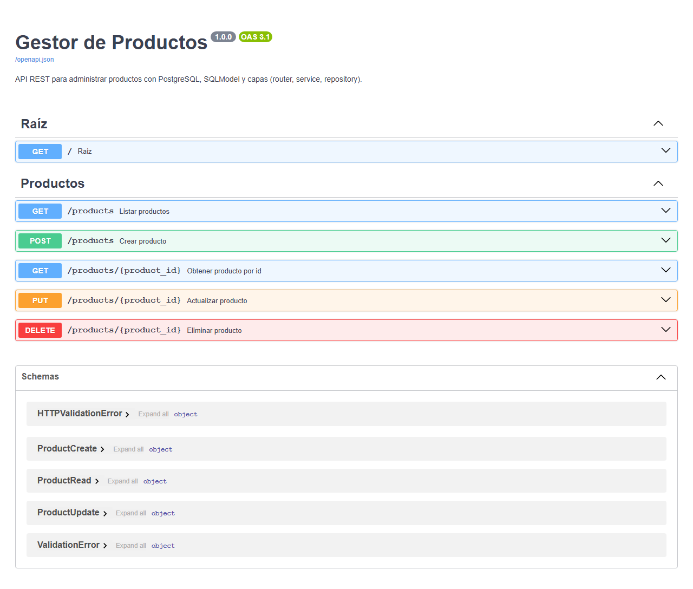
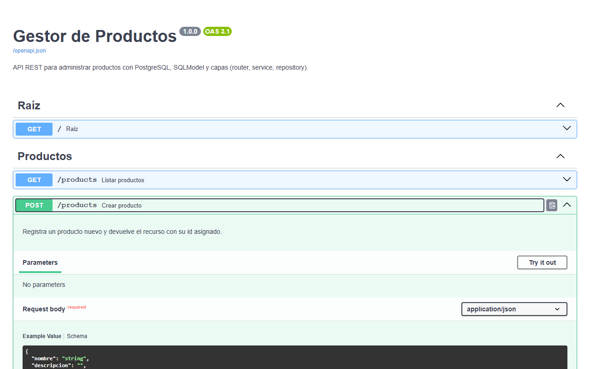
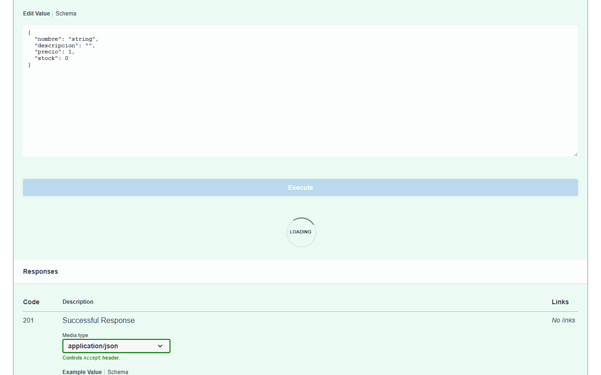
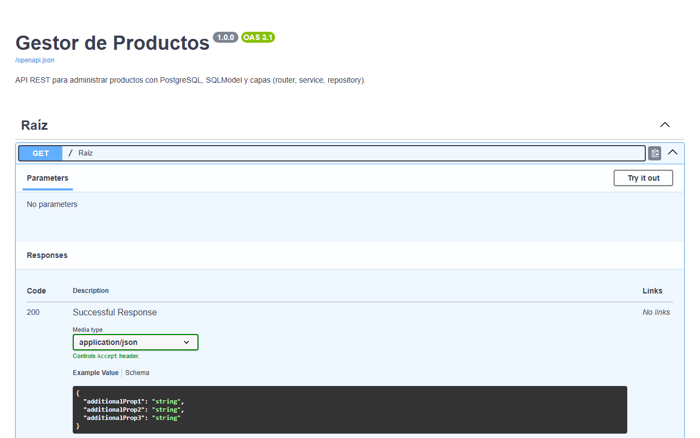

# Entrega - Trabajo Practico Integrador

## 1) Descripcion breve de la funcionalidad agregada

Se desarrollo una API REST profesional con FastAPI para gestion de inventario, implementada con arquitectura modular.
La solucion incluye dos modulos principales:

- `categorias`: alta, listado paginado, detalle, actualizacion total y desactivacion logica.
- `productos`: alta, listado paginado, detalle, actualizacion total, desactivacion logica y consulta de estado de stock.

Se aplicaron validaciones de datos con Pydantic, uso de `response_model` para respuestas controladas y almacenamiento en memoria con listas de Python.

## 2) Capturas de Swagger (nuevos endpoints)

**Vista General de Endpoints:**


**Detalle de Endpoint de Categorias Abierto:**


**Ejecucion del Endpoint (Try it out):**


**Detalle de Endpoint GET:**


## 3) Ejemplo de request y response correctos

### 3.1 Crear categoria

**Request** (`POST /categorias/`)

```json
{
  "nombre": "Muebles",
  "codigo": "MUE-01",
  "descripcion": "Categoria para productos de mobiliario"
}
```

**Response 201**

```json
{
  "nombre": "Muebles",
  "codigo": "MUE-01",
  "descripcion": "Categoria para productos de mobiliario",
  "id": 1,
  "activo": true
}
```

### 3.2 Crear producto

**Request** (`POST /productos/`)

```json
{
  "nombre": "Silla Ergonomica",
  "descripcion": "Silla para oficina con soporte lumbar",
  "precio": 150000,
  "stock": 8,
  "stock_minimo": 5,
  "categoria_id": 1
}
```

**Response 201**

```json
{
  "nombre": "Silla Ergonomica",
  "descripcion": "Silla para oficina con soporte lumbar",
  "precio": 150000.0,
  "stock": 8,
  "stock_minimo": 5,
  "categoria_id": 1,
  "id": 1,
  "activo": true
}
```

### 3.3 Consultar estado de stock

**Request** (`GET /productos/1/stock`)

**Response 200**

```json
{
  "id": 1,
  "stock_actual": 8,
  "bajo_stock_minimo": false
}
```

## 4) Ejemplo de manejo de error (404 o 422)

### Opcion A: Error 404 (producto no encontrado)

**Request** (`GET /productos/999`)

**Response 404**

```json
{
  "detail": "Producto no encontrado"
}
```

### Opcion B: Error 422 (validacion de categoria)

**Request invalido** (`POST /categorias/`)

```json
{
  "nombre": "Muebles",
  "codigo": "mue-1",
  "descripcion": "Codigo invalido"
}
```

**Response 422** (resumen)

```json
{
  "detail": [
    {
      "type": "string_pattern_mismatch",
      "loc": ["body", "codigo"],
      "msg": "String should match pattern '^[A-Z]{3}-\\d{2}$'"
    }
  ]
}
```

## 5) Verificacion de requisitos solicitados

- [x] Estructura modular correcta (`app`, `modules`, `routers`, `schemas`, `services`).
- [x] Codigo limpio y organizado por responsabilidades.
- [x] `requirements.txt` actualizado con `fastapi[standard]`.
- [x] Endpoints documentados en Swagger.
- [x] Validaciones implementadas con Pydantic.

---

## Anexo: comando para ejecutar la API

Desde la carpeta `tp1`:

```bash
pip install -r requirements.txt
uvicorn app.main:app --reload
```

Swagger:

`http://127.0.0.1:8000/docs`
